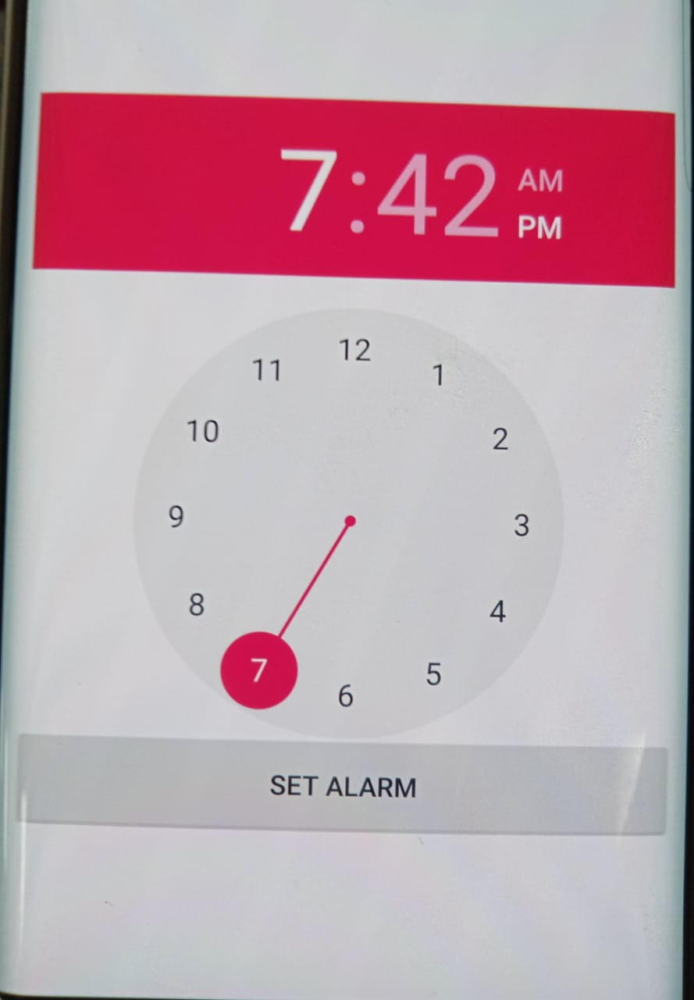

# android_app_using_service_wake
This app will show the demo, how android wake lock service works even if you kill the app.. It will run in background.
Here you can set an alarm and kill the app.. even after that you will get toast for that alarm. 

NOTE: This Android code works only for ANDROID 8 or less version. 

 
